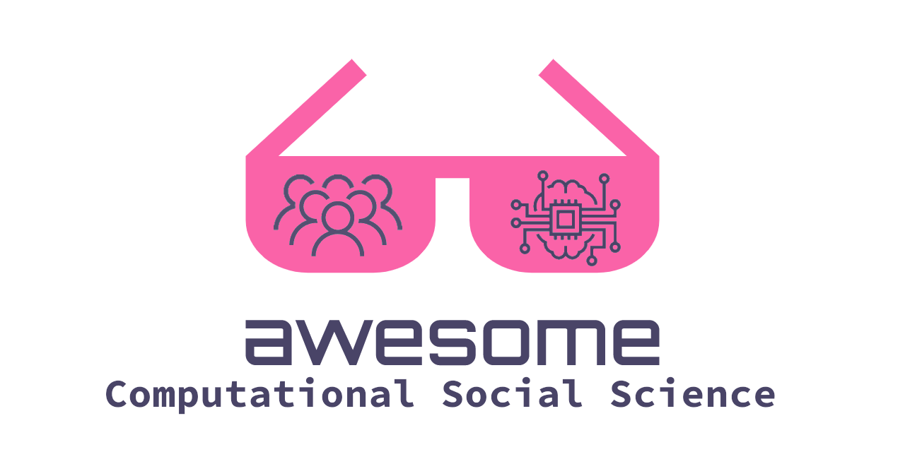

# Awesome Computational Social Science 

>An [awesome](https://github.com/sindresorhus/awesome) curated list of
>resources for Computational Social Science.  
> Inspired by [Awesome Network
> Analysis](https://github.com/briatte/awesome-network-analysis) and others.

The order of entries within categories is either alphabetically or
chronologically.  
**Please add your resources according to the respective ordering**

## Contents

- __[Books](#books)__
- __[Conferences](#conferences)__
- __[Education](#education)__
  - [Online courses and Material](#online-courses-and-material)
  - [Videos and Lectures](#videos-and-lectures)
  - [Workshops](#workshops)
  - [University Course Programs](#university-course-programs)
- __[Research Groups](#research-groups)__
- __[Journals](#journals)__
- __[Selected Papers](#selected-papers)__
- __[Software](#software)__
  - [R](#R)
  - [Python](#python)
  - [Tutorials](#tutorials)
- __[Miscellaneous](#miscellaneous)__
- __[Relevant Awesome Lists](#relevant-awesome-lists)__
- __[Contributing](#contributing)__

## Books

> Entries are ordered chronologically

- [Growing Artificial Societies: Social Science from the Bottom Up](https://mitpress.mit.edu/9780262550253/growing-artificial-societies/), by By Joshua M. Epstein and Robert L. Axtell (1996)
- [Six Degrees: The Science of a Connected Age](https://wwnorton.com/books/9780393325423), by Duncan J. Watts (2004)
- [Networks, Crowds, and Markets: Reasoning About a Highly Connected World](https://www.cs.cornell.edu/home/kleinber/networks-book/), by David Easley and Jon Kleinberg (2010)
- [Everything is Obvious](https://www.penguinrandomhouse.com/books/187477/everything-is-obvious-by-duncan-j-watts/), by Duncan J. Watts (2011)
- [Agent_Zero: Toward Neurocognitive Foundations for Generative Social Science](https://press.princeton.edu/books/hardcover/9780691158884/agentzero), by Joshua M. Epstein (2014)
- [Computational Social Sciences](https://www.springer.com/series/11784/books?page=3), Springer book series (2015-2023)
- [Big Data Is Not a Monolith](https://mitpress.mit.edu/9780262529488/big-data-is-not-a-monolith/), edited by Cassidy R. Sugimoto, Hamid R. Ekbia, and Michael Mattioli (2016)
- [Bit By Bit: Social Research in the Digital Age](https://www.bitbybitbook.com/) by Matthew J. Salganik (2017)
- [Decoding the Social World: Data Science and the Unintended Consequences of Communication](https://mitpress.mit.edu/9780262037075/) by Sandra González-Bailón (2017)
- [Digital Sociology: The Reinvention of Social Research](https://www.wiley.com/en-us/Digital+Sociology:+The+Reinvention+of+Social+Research-p-9780745684789) by Noortje Marres (2017)
- [The Model Thinker: What You Need to Know to Make Data Work for You](https://www.basicbooks.com/titles/scott-e-page/the-model-thinker/9780465094639/), by Scott E. Page (2018)
- [What is Digital Sociology?](https://www.wiley.com/en-us/What+is+Digital+Sociology%3F-p-9781509527144), by Neil Selwyn (2019)
- [The Oxford Handbook of Networked Communication](https://global.oup.com/academic/product/the-oxford-handbook-of-networked-communication-9780190460518?cc=de&lang=en&) edited by Brooke Foucault Welles and Sandra González-Bailón (2020)
- [Research Exposed: How Empirical Social Science Gets Done in the Digital Age](https://cup.columbia.edu/book/research-exposed/9780231188777) edited by Eszter Hargittai (2020)
- [Retooling Politics: How Digital Media Are Shaping Democracy](https://doi.org/10.1017/9781108297820) by Andreas Jungherr, Gonzalo Rivero, and Daniel Gayo-Avello (2020)
- [Sociologia Digital: uma breve introdução](https://repositorio.ufba.br/bitstream/ri/32746/5/SociologiaDigitalPDF.pdf) by Leonardo Nascimento (2020)
- [How Humans Judge Machines](https://www.judgingmachines.com/), by Cesar A. Hidalgo, Diana Orghian, Jordi Albo Canals, Filipa De Almeida, Natalia Martin (2021)
- [The Science of Science](https://www.dashunwang.com/book/the-science-of-science), by Dashun Wang and Albert-László Barabási (2021)
- [Doing Computational Social Science - A Practical Introduction](https://uk.sagepub.com/en-gb/eur/doing-computational-social-science/book266031) by John McLevey (2021)
- [Big Data and Social Science: Data Science Methods and Tools for Research and Practice, 2nd Edition](https://textbook.coleridgeinitiative.org/) by Ian Foster, Rayid Ghani, Ron S. Jarmin, Frauke Kreuter and Julia Lane (2021)
- [Text as Data: A New Framework for Machine Learning and the Social Sciences](https://press.princeton.edu/books/paperback/9780691207551/text-as-data) by Justin Grimmer, Margaret E. Roberts, and Brandon M. Stewart (2022)
- [Computational Analysis of Communication](https://cssbook.net/) by Wouter van
  Atteveldt, Damian Trilling, and Carlos Arcila Calderon (2022)
- [The SAGE Handbook of Social Media Research
  Methods](https://uk.sagepub.com/en-gb/eur/the-sage-handbook-of-social-media-research-methods/book272098)
  edited by Anabel Quan-Haase and Luke Sloan (2022)
- [Research Handbook on Digital Sociology](https://www.e-elgar.com/shop/gbp/research-handbook-on-digital-sociology-9781789906752.html) edited by Jan Skopek (2023)
- [Handbook of Computational Social Science for Policy](https://link.springer.com/book/10.1007/978-3-031-16624-2) by Eleonora Bertoni, Matteo Fontana, Lorenzo Gabrielli, Serena Signorelli, Michele Vespe (2023)

## Conferences

> Relevant conferences where the community (or parts thereof) meets

- [BigSurv - Big Data Meets Survey Science](https://www.bigsurv.org/)
- [CHI - ACM CHI Conference on Human Factors in Computing Systems](https://chi.acm.org/)
- [Complex Networks - International Conference on Complex Networks and their Applications](https://www.complexnetworks.org/)
- [COMPTEXT Conference](https://www.comptextconference.org/)
- [Conference on Complex Systems](https://cssociety.org/events), in particular the Computational Social Science satellite
- [EPSA - European Political Science Association Conference](https://epsanet.org/) (Methods division)
- [IC2S2 - The International Conference for Computational Social Science](http://ic2s2.org)
- [ICA - Annual International Communication Association Conference](https://www.icahdq.org/) (Methods Division)
- [ICWSM - International AAAI Conference on Web and Social Media](https://www.icwsm.org/)
- [NetSci - International Conference on Network Science](https://netscisociety.net/events/netsci/)

[Computational Social Science Events Worldwide](https://calendar.google.com/calendar/u/0/embed?src=19jm0329h91akpv0srml6c24ec@group.calendar.google.com&ctz=Europe/Rome), Public Calendar

## Education

> Learning material/courses tailored towards Computational Social
> Science

### Online Courses and Material

> See also the [Software](#software) section for material on software tools

- [SAGE collection of teaching material for Computational Social Science](https://ocean.sagepub.com/teaching-materials-for-computational-social-science) - Large collection of various teaching material for Computational Social Science
- [SICSS Learning Materials](https://sicss.io/overview) - Open source teaching and learning resources for computational social science
- [Social and Economic Networks: Models and Analysis](https://www.coursera.org/learn/social-economic-networks) - Online course on social and economic networks taught by Matthew O. Jackson
- [Toolkit for Digital Methods](https://wiki.helsinki.fi/display/TDM/Toolkit+for+Digital+Methods+Home) - A wiki of resources for digital methods in Social Sciences

### Videos and Lectures

- [A gentle introduction to network science](https://www.youtube.com/watch?v=L6CqqlILBCI), by Renaud Lambiotte, University of Oxford (2018)
- [Introduction to computational social science](https://youtu.be/EF7X9wwl0q4), by Matthew J. Salganik, Princeton University (2019)

### Workshops

- [BIGSSS Computational Social Science Summer Schools](https://www.bigsss-bremen.de/academic-program/summer-school-program/computational-social-science-summer-schools)
- [Edinburgh Data and Text Analysis Summer School](https://www.cdcs.ed.ac.uk/training/Data-Text-Analysis-Summer-School)
- [Essex Summer School in Social Science Data Analysis](https://essexsummerschool.com/)
- [GESIS Fall Seminar in Computational Social
  Science](https://www.gesis.org/en/gesis-training/what-we-offer/fall-seminar-in-computational-social-science)
- [The Summer Institutes in Computational Social Science](https://sicss.io/)
- [Topics in Digital and Computational Demography](https://www.demogr.mpg.de/en/career_6122/international_advanced_studies_in_demography_6682/courses_6931/), PhD level, one week course.

### University Course Programs

> Bachelor, Master, PhD programs (alphabetically by country using [ISO 3166-1 alpha 3](https://en.wikipedia.org/wiki/ISO_3166-1) codes)

- [Master Computational Social System](https://www.tugraz.at/en/studying-and-teaching/degree-and-certificate-programmes/masters-degree-programmes/computational-social-systems),
  TU Graz, AUT
- [Master of Science program in Social Data Science](https://networkdatascience.ceu.edu/msc-social-data-science), Central European University, AUT
- [Master of Sociology: Quantitative Analysis and Social Data Science specialisation](https://soc.kuleuven.be/fsw/toekomstigestudenten/english/mos/datascience), KU Leuven, BEL 
- [Master in Computational Social Sciences](https://www.unilu.ch/studium/studienangebot/master/kultur-und-sozialwissenschaftliche-fakultaet/lucerne-master-in-computational-social-sciences-lumacss/) at the University of Lucerne, CHE
- [Master of Arts in Political Science with Focus on Computational Social Sciences](https://www.uni-bamberg.de/en/political-science/studies/master-of-arts-in-political-science/focuses/computational-social-sciences/),
University of Bamberg, DEU
- [Master of Data Science for Public Policy](https://www.hertie-school.org/en/mds), Hertie School, DEU
- [Master Social and Economic Data Science](https://www.polver.uni-konstanz.de/studium/master/master-social-and-economic-data-science/),
University of Konstanz, DEU
- [M.Sc. Quantitative Data Science Methods: Psychometrics, Econometrics and Machine Learning](https://uni-tuebingen.de/fakultaeten/wirtschafts-und-sozialwissenschaftliche-fakultaet/faecher/fachbereich-sozialwissenschaften/methodenzentrum/studium/msc-qds/), University of Tübingen, DEU
- ~~[Master Computational Social Systems](https://www.rwth-aachen.de/cms/root/Studium/Vor-dem-Studium/Studiengaenge/Liste-Aktuelle-Studiengaenge/Studiengangbeschreibung/~sthd/Computational-Social-Systems-M-Sc/)~~ (This course of study is being phased out), RWTH Aachen, DEU
- [Master of Science (MSc) in Social Data Science](https://studies.ku.dk/masters/social-data-science/), University of Copenhagen, DNK
- [Master in Computational Social Science](https://www.uc3m.es/master/computational-social-science), Universidad Carlos III de Madrid, ESP
- [MSc&T “Data and Economics for Public Policy”](https://programmes.polytechnique.edu/en/master-all-msct-programs/data-and-economics-for-public-policy), Institut Polytechnique de Paris, FRA
- [Master in Data Science for Social Sciences](https://www.tse-fr.eu/master-data-science-social-sciences), Toulouse School of Economics, FRA
- [MSc Applied Social Data Science](https://www.lse.ac.uk/Methodology/Study/MSc-Applied-Social-Data-Science), London School of Economics and Political Science, GBR
- [MPA in Data Science for Public Policy](https://www.lse.ac.uk/school-of-public-policy/study/mpaindatascience), London School of Economics and Political Science, GBR
- [MSc Social and Geographic Data Science](https://www.ucl.ac.uk/prospective-students/graduate/taught-degrees/social-and-geographic-data-science-msc), University College London, GBR
- [MSc Data Science and Public Policy](https://www.ucl.ac.uk/prospective-students/graduate/taught-degrees/data-science-and-public-policy-political-science-msc), University College London, GBR
- [MSc Human and Social Data Science](https://www.sussex.ac.uk/study/masters/courses/human-and-social-data-science-msc), University of Sussex, GBR
- [MSc Social Data Science](https://www.exeter.ac.uk/study/postgraduate/courses/politics/socialdatasciencemsc/), University of Exeter, GBR
- [MSc Social Data Science](https://www.oii.ox.ac.uk/study/msc-in-social-data-science/), University of Oxford, GBR
- [DPhil Social Data Science](https://www.oii.ox.ac.uk/study/dphil-in-social-data-science/), University of Oxford, GBR
- [Master Politics and Data Science](https://www.ucd.ie/connected_politics/studywithus/), University College Dublin, IRE
- [MSc Social Data Science](https://hub.ucd.ie/usis/!W_HU_MENU.P_PUBLISH?p_tag=PROG&MAJR=W559), University College Dublin, IRE
- [PhD Quantitative and Computational Social Science](https://www.ucd.ie/spire/study/prospectivephdstudents/phdquantitativeandcomputationalsocialscience/), University College Dublin, IRE
- [MSc/PG Diploma Applied Social Data Science](https://www.tcd.ie/Political_Science/postgraduate/pg-dip-applied-social-data-science/), Trinity College Dublin, IRE
- [Master Data Science for Economics](https://dse.cdl.unimi.it/en), University of Milan, ITA
- [Master (Research) in Societal Resilience - Big Data for Society](https://vu.nl/en/education/master/societal-resilience/), Vrije Universiteit Amsterdam, NLD
- [Bachelor Computational Social Science](https://www.uva.nl/en/programmes/bachelors/computational-social-science/study-programme/study-programme.html), University of Amsterdam, NLD
- [Master's Programme Computational Social Science](https://liu.se/en/education/program/f7mcd), Linköping University, SWE
- [Master Computational Social Science](https://gsssh.ku.edu.tr/en/departments/computational-social-sciences/),
Koç University, TUR
- [M.S. in Computational Social Science](https://css.ucsd.edu/masters/index.html), University of California San Diego, USA
- [M.A. in Computational Social Science](https://macss.uchicago.edu/), University of Chicago, USA
- [M.S. in Computational Analysis & Public Policy](https://capp.uchicago.edu/), University of Chicago, USA
- [Master of Science in Data Analytics & Computational Social Science](https://www.umass.edu/social-sciences/academics/data-analytics-computational-social-science/ms-dacss), University of Massachusetts Amherst, USA
- [Master of Arts in Interdisciplinary Studies: Computational Social Science Concentration](https://mais.gmu.edu/programs/la-mais-isin-css), George Mason University, USA
- [PhD in Computational Social Science](https://science.gmu.edu/academics/departments-units/computational-data-sciences/computational-social-science-phd), George Mason University, USA
- [Master of Science in Data Science for Public Policy](https://mccourt.georgetown.edu/master-of-science-in-data-science-for-public-policy/), Georgetown University, USA
- [Master of Science in Public Policy and Data Science](https://priceschool.usc.edu/mppds/), University of Southern California, USA
- [Master's Degree Applied Urban Science and Informatics](https://cusp.nyu.edu/masters-degree/), New York University, USA
- [Master of Science in Survey and Data Science](https://surveydatascience.isr.umich.edu/survey-and-data-science-masters-degree-program), University of Michigan, USA
- [Master of Science in Social Policy + Data Analytics for Social Policy Certificate](https://www.sp2.upenn.edu/program/master-of-science-in-social-policy-data-analytics-for-social-policy-certificate/), University of Pennsylvania, USA

## Research Groups

> Ordered alphabetically by country and city (using [ISO 3166-1 alpha 3](https://en.wikipedia.org/wiki/ISO_3166-1) country codes)
- [Data Science and AI Lab](https://nyuad.nyu.edu/en/research/faculty-labs-and-projects/data-science-and-ai-lab.html), Abu Dhabi, ARE
- [Computational Social Science Lab](https://www.sydney.edu.au/arts/our-research/centres-institutes-and-groups/sydney-social-sciences-and-humanities-advanced-research-centre/research/computational-social-science-lab.html), University of Sydney, AUS
- [CSS Lab TU Graz](https://www.tugraz.at/institute/isds/research/research-groups/computational-social-science-lab-css-lab/), Graz, AUT
- [Digital Humanities Lab at UFBA](https://www.labhd.ufba.br/), Salvador, BRA
- [Social Networks Lab](https://sn.ethz.ch/), Zürich, CHE
- [Computational Communication Collaboratory](https://computational-communication.com/), Nanjing, CHN
- [CSS Lab RWTH Aachen](https://www.css-lab.rwth-aachen.de/), Aachen, DEU
- [CSS Department at GESIS](https://www.gesis.org/en/institute/departments/computational-social-science), Cologne, DEU
- [Computational Social Science and Big Data TUM Munich](https://www.hfp.tum.de/css/startseite/), Munich, DEU
- [Department of Digital and Computational Demography](https://www.demogr.mpg.de/en/research_6120/digital_and_computational_demography_zagheni_11666/), Rostock, DEU
- [Copenhagen Center for Social Data Science (SODAS)](https://sodas.ku.dk), Copenhagen, DNK
- [NEtwoRks, Data, and Society (NERDS)](https://nerds.itu.dk/), Copenhagen, DNK
- [Institute for Cross-Disciplinary Physics and Complex Systems (IFISC)](https://ifisc.uib-csic.es/en/research/dynamics-and-collective-phenomena-social-systems/), Palma, ESP
- [Centre for Social Data Science](https://www.helsinki.fi/en/networks/centre-social-data-science), Helsinki, FIN
- [Centre for Data, Culture & Society](https://www.cdcs.ed.ac.uk/), Edinburgh, GBR
- [Oxford Internet Institute](https://www.oii.ox.ac.uk/about/), Oxford, GBR
- [Social Data Institute](https://www.ucl.ac.uk/social-data/home/social-data-institute), University College London, GBR
- [Web Mining Lab](http://weblab.com.cityu.edu.hk/blog/), City University of Hong Kong,Hong Kong, HKG
- [Computational Social Sciences and Law Lab](https://www.cityu.edu.hk/cpal/lab_cssl.htm), City University of Hong Kong, Hong Kong, HKG
- [Connected_Politics Lab](https://www.ucd.ie/connected_politics/), Dublin, IRL
- [Behave Lab](https://behavelab.org/), Milan, ITA
- [Center of Data Science and Complexity for Society (CDCS)](https://cdcs.di.uniroma1.it/index.php), Sapienza University, Rome, ITA
- [Center for Computational Social Science and Human Dynamics (C2S2)](https://c2s2.unitn.it), University of Trento and Bruno Kessler Foundation, Trento, ITA
- [Mobile and Social Computing Lab (MobS Lab)](https://ict.fbk.eu/units/mobs/), Bruno Kessler Foundation, Trento, ITA
- [CENTAI Institute](https://centai.eu), Turin, ITA
- [Computational Social Science Lab](https://www.colorlessgreen.info/), Tokyo Institute of Technology, Tokyo, JPN
- [Computational Communication Science Amsterdam](https://ccs.amsterdam), NLD
- [Social and Behavioural Data Science Centre](https://sobedsc.uva.nl/), Amsterdam, NLD
- [ODISSEI (Open Data Infrastructure for Social Science and Economic Innovations)](https://odissei-data.nl/en/), Rotterdam, NLD
- [Communication Data and Network Analytics Lab](https://cdna.survey.sinica.edu.tw/), Academia Sinica, Taipei, TWN
- [Observatory on Social Media](https://osome.iu.edu/), Indiana University, Bloomington, USA
- [Soda (Social Data and AI) Lab](https://soda-labo.github.io/), Indiana University, Bloomington, USA
- [Lazerlab](https://lazerlab.net/), Northeastern University, Boston, USA
- [Laboratory for the Modeling of Biological and Socio-Technical Systems (MOBS Lab)](https://www.mobs-lab.org/), Northeastern University, Boston, USA
- [Social data science center](https://socialdatascience.umd.edu/), University of Maryland, College Park, USA
- [Computational Social Science Institute at UMass](https://www.cssi.umass.edu), Massachusetts Amherst, USA
- [Working Group on Computational Social Science](https://datascience.columbia.edu/research/groups/computational-social-science/), Columbia University, New York, USA
- [Center for Computational Analysis of Social and Organizational Systems (CASOS)](http://www.casos.cs.cmu.edu/index.php), Carnegie Mellon University, Pittsburgh, USA
- [IRiSS Center for Computational Social Science](https://iriss.stanford.edu/research-centers/computational-social-science), Stanford University, USA

## Journals

> Ordered alphabetically

- [Big Data & Society](https://journals.sagepub.com/home/bds)
- [Computational Communication Research](https://computationalcommunication.org/ccr)
- [Computational Economics](https://www.springer.com/journal/10614)
- [EPJ Data Science](https://epjdatascience.springeropen.com/)
- [Frontiers in Big Data](https://www.frontiersin.org/journals/big-data)
- [Information, Communication & Society](https://www.tandfonline.com/journals/rics20)
- [Journal of Artificial Societies and Social Simulation](https://www.jasss.org/JASSS.html)
- [Journal of Computational Social Science](https://www.springer.com/journal/42001)
- [Journal of Quantitative Description: Digital Media](https://journalqd.org)
- [Nature Human Behavior](https://www.nature.com/nathumbehav/)
- [New Media & Society](https://journals.sagepub.com/home/nms)
- [Social Media and Society](https://journals.sagepub.com/home/sms)
- [Social Science Computer Review](https://journals.sagepub.com/home/ssc)

## Selected Papers

> Important papers for/about the field, not specific research. Ordered chronologically.

- [From Factors to Actors: Computational Sociology and Agent-Based Modeling](https://doi.org/10.1146/annurev.soc.28.110601.141117) by Michael W. Macy and Robert Willer (2002)
- [Life in the network: the coming age of computational social science](https://doi.org/10.1126%2Fscience.1167742) by David Lazer et al. (2009)
- [Critical Questions for Big Data](https://doi.org/10.1080/1369118X.2012.678878) by Dana Boyd and Kate Crawford (2012)
- [A 61-million-person experiment in social influence and political mobilization](https://doi.org/10.1038/nature11421) by Robert M. Bond et al. (2012)
- [Manifesto of computational social science](https://doi.org/10.1140/epjst/e2012-01697-8) by R. Conte, N. Gilbert, G. Bonelli, C. Cioffi-Revilla, G. Deffuant, J. Kertesz, V. Loreto, S. Moat, J. -P. Nadal, A. Sanchez, A. Nowak, A. Flache, M. San Miguel & D. Helbing (2012)
- [Digital Footprints: Opportunities and Challenges for Online Social Research](https://doi.org/10.1146/annurev-soc-071913-043145) by Scott A. Golder and Michael W. Macy (2014)
- [Social media for large studies of
  behavior](https://doi.org/10.1126/science.346.6213.1063) by Derek Ruths and Jürgen Pfeffer (2014)
- [Sociology in the Era of Big Data: The Ascent of Forensic Social Science](https://doi.org/10.1007/s12108-015-9291-8) by Daniel A. McFarland, Kevin Lewis & Amir Goldberg (2016)
- [Installing computational social science: Facing the challenges of new information and communication technologies in social science](http://journals.sagepub.com/doi/10.1177/2059799115622763) by Raphael H. Heiberger & Jan R. Riebling (2016)
- [Computational Social Science Methodology, Anyone?](https://doi.org/10.1027/1614-2241/a000127) by Joop J. Hox (2017)
- [The empiricist’s challenge: Asking meaningful questions in political science in the age of big data](https://doi.org/10.1080/19331681.2017.1312187) by Andreas Jungherr and Yannis Theocharis (2017)
- [Computational Social Science ≠ Computer Science + Social Data](https://dl.acm.org/doi/10.1145/3132698) by Hanna Wallach (2018)
- [When Communication Meets Computation: Opportunities, Challenges, and Pitfalls in Computational Communication Science](https://doi.org/10.1080/19312458.2018.1458084) by Wouter van Atteveldt and Tai-Quan Peng (2018)
- [Analytical sociology and computational social science](https://doi.org/10.1007/s42001-017-0006-5) by Keuschnigg, M., Lovsjö, N. & Hedström, P. (2018)
- [Computation and the Sociological Imagination](https://doi.org/10.1177/1536504219883850) by James Evans and Jacob G. Foster (2019)
- [Machine Learning for Sociology](https://doi.org/10.1146/annurev-soc-073117-041106) by Mario Molina and Filiz Garip (2019)
- [Computational social science: Obstacles and opportunities](https://www.science.org/doi/abs/10.1126/science.aaz8170) by David Lazer et al. (2020) ([open access version](https://dspace.mit.edu/bitstream/handle/1721.1/130299/Computational%20social%20science-%20Obstacles%20and%20opportunities.pdf?sequence=1))
- [Computational Social Science and the Study of Political Communication](https://doi.org/10.1080/10584609.2020.1833121) by Yannis Theocharis and Andreas Jungherr (2020)
- [Computational Social Science and Sociology](https://doi.org/10.1146/annurev-soc-121919-054621) by Achim Edelmann, Tom Wolff, Danielle Montagne and Christopher A. Bail (2020)
- [Measuring algorithmically infused societies](https://doi.org/10.1038/s41586-021-03666-1) by Claudia Wagner, Markus Strohmaier, Alexandra Olteanu, Emre Kıcıman, Noshir Contractor & Tina Eliassi-Rad (2021)
- [The data revolution in social science needs qualitative research](https://doi.org/10.1038/s41562-022-01333-7) by Nikolitsa Grigoropoulou & Mario L. Small (2022)

## Software

> Focus on accessible introduction into computational tools, preferably open
> source material

### R

- [Awesome R](https://github.com/qinwf/awesome-R) for general resources in R

### Python

- [Awesome Python](https://github.com/vinta/awesome-python) (other lists: [1](https://github.com/kirang89/pycrumbs), [2](https://github.com/svaksha/pythonidae), [3](https://github.com/trekhleb/learn-python)) for general resources in Python

### Tutorials

- [APIs for Social Scientists](https://bookdown.org/paul/apis_for_social_scientists/)
- [Introduction to Computational Social Science in R](https://bookdown.org/markhoff/css/)
- [Introduction to Computational Social Science Methods with Python](https://github.com/gesiscss/css_methods_python)
- [Quanteda Tutorials for Quantitative Text Analysis in R](https://tutorials.quanteda.io)
- [R Course Material for Communication Science](https://github.com/ccs-amsterdam/r-course-material)

## Miscellaneous

> Resources that do not fit into other categories

- [Google Group Computational Social Science Network](https://groups.google.com/g/CSSNET)
- [Podcast about Computational Communication Science](https://anchor.fm/ccs-pod)
- [RatSWD publication "Big data in social, behavioural, and economic sciences: Data access and research data management (Including an expert opinion on "Web scraping in independent academic research")"](https://www.konsortswd.de/en/latest/publication/big-data-in-social-behavioural-and-economic-sciences-data-access-and-research-data-management/)
- [reddit community "CompSocial"](https://www.reddit.com/r/CompSocial/)

## Relevant Awesome Lists

- [Awesome Causality](https://github.com/napsternxg/awesome-causality)
- [Awesome Community Detection](https://github.com/benedekrozemberczki/awesome-community-detection)
- [Awesome Data Science with Python](https://github.com/r0f1/datascience) ([another](https://github.com/krzjoa/awesome-python-data-science))
- [Awesome Data Science](https://github.com/academic/awesome-datascience)
- [Awesome Data Visualization](https://github.com/javierluraschi/awesome-dataviz)
- [Awesome Deep Learning](https://github.com/ChristosChristofidis/awesome-deep-learning)
- [Awesome Digital Humanities](https://github.com/dh-tech/awesome-digital-humanities)
- [Awesome Julia](https://github.com/greister/Awesome-Julia)
- [Awesome Jupyter](https://github.com/markusschanta/awesome-jupyter)
- [Awesome Machine Learning](https://github.com/josephmisiti/awesome-machine-learning)
- [Awesome MySQL](https://github.com/shlomi-noach/awesome-mysql)
- [Awesome Network Analysis](https://github.com/briatte/awesome-network-analysis)
- [Awesome NLP](https://github.com/keon/awesome-nlp) ([another one](https://github.com/edobashira/speech-language-processing))
- [Awesome Notebooks](https://github.com/jupyter-naas/awesome-notebooks)
- [Awesome Open Science](https://github.com/silky/awesome-open-science)
- [Awesome Python](https://github.com/vinta/awesome-python) (other lists: [1](https://github.com/kirang89/pycrumbs), [2](https://github.com/svaksha/pythonidae), [3](https://github.com/trekhleb/learn-python))
- [Awesome Quarto](https://github.com/mcanouil/awesome-quarto)
- [Awesome R](https://github.com/qinwf/awesome-R)
- [Awesome Research Software Registries](https://github.com/NLeSC/awesome-research-software-registries)
- [Awesome Scholarly Data Analysis](https://github.com/napsternxg/awesome-scholarly-data-analysis)

-----

## Contributing

Contributions welcome! Read the [contribution guidelines](contributing.md) first.

